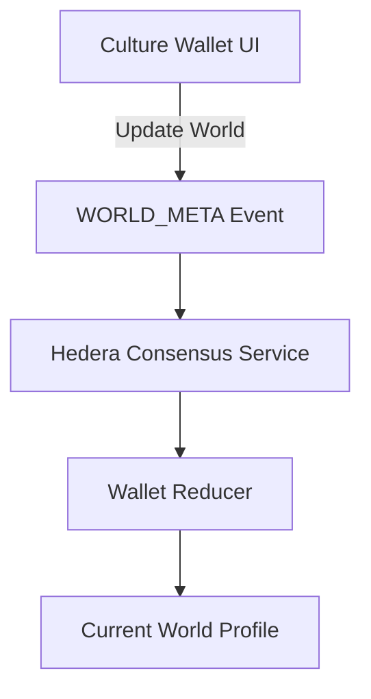
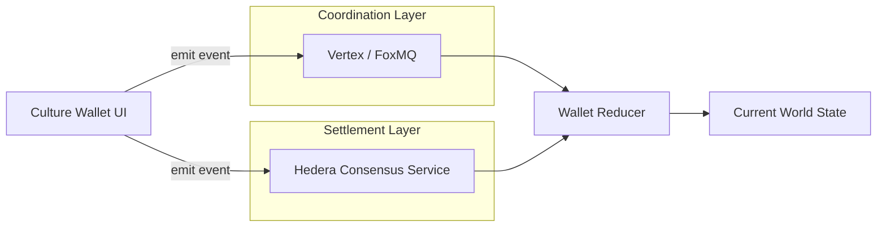

# Culture Wallet × Tashi Alignment

**Status:** Alignment Review (Pre‑Production)

**Goal:** Confirm that Culture Wallet’s current HCS‑first implementation is directly compatible with Tashi’s Vertex / Arc architecture, and document the clean port path **without deviating from the current production trajectory**.

---

## 1. Design Principles (Non‑Negotiables)

These principles are already enforced in the Culture Wallet codebase and **will not change**:

- Append‑only events (no overwrites)
- Derived state (wallet/client reduces streams)
- Deterministic replay
- Transport‑agnostic event schema
- Separation of coordination vs settlement

These principles intentionally mirror event‑sourced and DAG‑based systems.

---

## 2. Culture Wallet Today (Production Path)

### Conceptual Model

- **World** = application‑level namespace
- **WORLD_META events** = governance + identity updates for a World
- **HCS** = canonical settlement + audit log
- **Wallet** = deterministic reducer

### Event Shape (WORLD_META v1.1)

Key properties:
- `worldId` — stable namespace
- `eventId` — globally unique
- `revision` *or* `prevEventId` — causal ordering
- `contentHash` — integrity
- `payload.op` — CREATE | UPDATE | FREEZE

Each click on **Update World** emits a *new* event.

No state is mutated in place.

---

## 3. Current Runtime Architecture

**Important:**
- HCS is the only transport today
- Wallet state is always derived

---

## 4. Tashi Architecture (Relevant Layers)

Tashi exposes **infrastructure primitives**, not application objects.

- **Vertex** → fast, leaderless coordination (DAG, causal ordering)
- **Arc** → settlement bridge to public chains (incl. Hedera)
- **Lattice** → infra, discovery, economics

Culture Wallet does **not** depend on Tashi semantics today, but is architected to slot in cleanly.

---

## 5. Alignment Mapping (Today vs Future)

### Logical Mapping

| Culture Wallet | Tashi Equivalent |
|--------------|------------------|
| World | Application‑defined namespace |
| WORLD_META event | Vertex coordination event |
| HCS Topic | Arc settlement stream |
| Wallet reducer | Application reducer |

### Architectural Mapping

**Key point:**
- Event schema and reducer remain identical
- Transport becomes pluggable

---

## 6. Why No Deviation Is Required

Culture Wallet already satisfies all known Tashi‑compatible invariants:

- Append‑only log
- Causal ordering via `revision` / `prevEventId`
- Deterministic replay
- Clear separation of fast coordination vs permanent settlement

The current HCS‑only model is a **valid Arc‑style deployment**.

Vertex can be introduced later **without rewriting application logic**.

---

## 7. Reducer Contract (Invariant)

The wallet resolves the authoritative World state using:

1. De‑dupe by `eventId`
2. Validate `contentHash`
3. Resolve head via:
   - Highest `revision`, else
   - `prevEventId` chain head, else
   - Consensus timestamp

This reducer works for:
- HCS only
- Vertex only
- Dual ingestion (HCS + Vertex)

---

## 8. Open Alignment Question for Tashi Team

### Vertex Stream ↔ World Mapping

**Question:**

> What is the recommended way to map a *logical application namespace* (e.g. `worldId`) onto Vertex?

Specifically:
- Should a World map to:
  - a single long‑lived Vertex stream?
  - a stream namespace/prefix?
  - a session or group abstraction?
- Are there constraints on:
  - number of streams per app
  - stream longevity
  - payload size or ordering guarantees

**Context:**
Culture Wallet treats `worldId` as the stable namespace and emits append‑only events. We want to preserve this invariant when introducing Vertex as a coordination layer.

---

## 9. Final Position

Culture Wallet is already building **inside Tashi’s architectural envelope**.

- No rename required
- No refactor required
- No premature coupling

This document exists to **confirm alignment**, not request permission to change course.

---

**Next Step:**
Confirm Vertex stream mapping guidance → lock topic/stream strategy → proceed to production on HCS.

